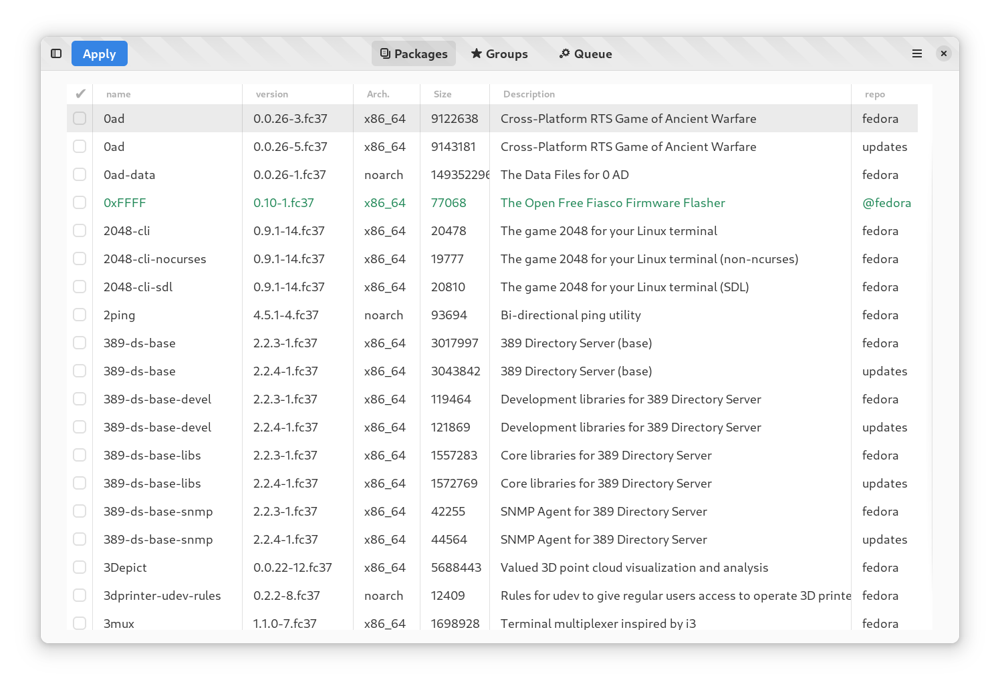

# Yum Extender (NextGen)

This is repository contains the first steps to create a future yum extender
with a more modern look & feel using gtk4/libadwaita etc.

The first steps is to build the GUI and later the real package handling functionality will be added

I will try to use DNF5 over Dbus for the package actions, if it is ready to solve the needs.

**This is very early in development, so it might take a long time before it is useful**

# current look

 

