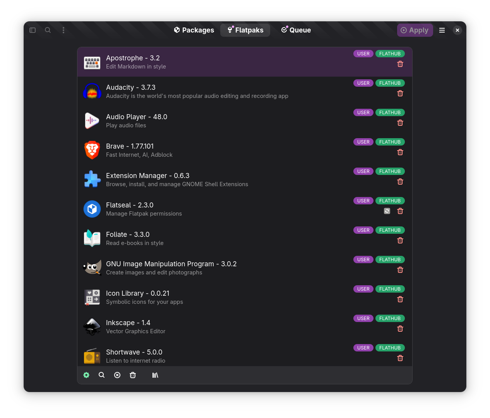

# Yum Extender (NextGen)

This is repository contains the first steps to create a future yum extender
with a more modern look & feel using gtk4/libadwaita etc.

The first steps is to build the GUI and later the real package handling functionality will be added

Follow news on the development on 

[X/Twitter](https://x.com/NerdyTim_666)

# how to test

- check out this repository
- install deps `make inst-deps`
- run `./local.sh`

# Packages for Fedora 39,40 & Rawhide

[Fedora Copr Repo](https://copr.fedorainfracloud.org/coprs/timlau/yumex-ng/)

# what is not working yet

- No group support
- No history support
- Changing enabled repositories in preferences

# current look

## Packages Page
 

## package view settings
 

## package search
 

## Queue Page
 

## flatpaks page
 

## flatpak installer
 

