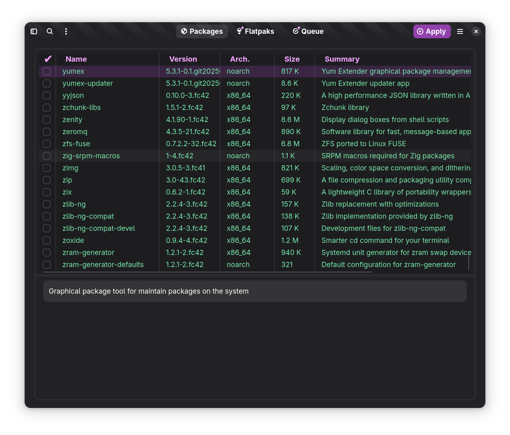

# Yum Extender (NextGen)

This is repository contains the first steps to create a future yum extender
with a more modern look & feel using gtk4/libadwaita etc.

The first steps is to build the GUI and later the real package handling functionality will be added

I will try to use DNF5 over Dbus for the package actions, if it is ready to solve the needs.

**This is very early in development, so it might take a long time before it is useful**

Follow news on the development on:

# how to test

* check out this repository
* install deps `make inst-deps`
* run `./local.sh`

# what is working

* View packages filtered by installed, updates & available
* Seach packages by name as you type (used .arch=noarch for searching for noarch in arch (.desc=... , .repo=..., .desc=...))
* Add packages to queue
* About Yum Extender

# what is not working

* Everything is readonly for now, so no changes to your system
* A lot of other stuff

# current look

## Packages Page
 

## package view settings
 

## Queue Page
 

