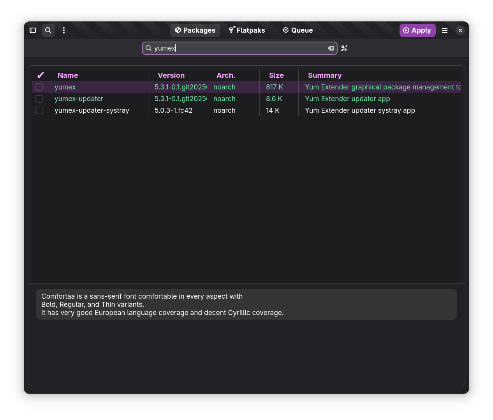

# Yum Extender

This is repository contains Yum Extender.
A graphical package tool for maintain rpm & flatpaks packages.

It is designed with a more modern look & feel using gtk4, libadwaita and are using dnf5daemon & libflatpak for package actions

It is primary developed to use in Fedora, but can be used in other rpm based distros, there have recent versions of gtk4, libadwaita & dnf5
It tracks the development of gtk4, libadwaita and dnf5 close, so it is not at good cadidate for long lived releases like RHEL.

Follow news in [Announcements](https://github.com/timlau/yumex-ng/discussions/categories/announcements)

## History
This is the 3. generation of Yum Extender.
- The first generation was working with yum back in the days.
- The second generation (yumex-dnf) was working with early version of dnf (version 2 - 4) using dnf-daemon 
- The current generation started as a re-design using gtk4 & libadwaita, using a more flexible backend with support for both dnf4 & dnf5, 
  but the latest version only support dnf5 and is using the dnf5daemon dbus API for all rpm actions. 

## how to test

-   check out this repository
-   install deps `make inst-deps`
-   run `./local.sh`

## build and install local test rpms

-   check out this repository
-   install deps `make inst-deps`
-   install build deps `make inst-build-tools`
-   `make test-inst` ( if yumex is not installed )
-   `make test-update` ( if yumex is installed on a previous date )
-   `make test-reinst` ( if yumex is installed on the same date )

## Packages for Fedora 41,42 & Rawhide (COPR)

**Stable**
[yumex-ng](https://copr.fedorainfracloud.org/coprs/timlau/yumex-ng/)

**Development**
[yumex-ng-dev](https://copr.fedorainfracloud.org/coprs/timlau/yumex-ng-dev/)

## Troubleshooting

[Check Here](docs/debug.md)

## current look

### Packages Page

### package view settings

### package search

### Queue Page

### flatpaks page

### flatpak installer

