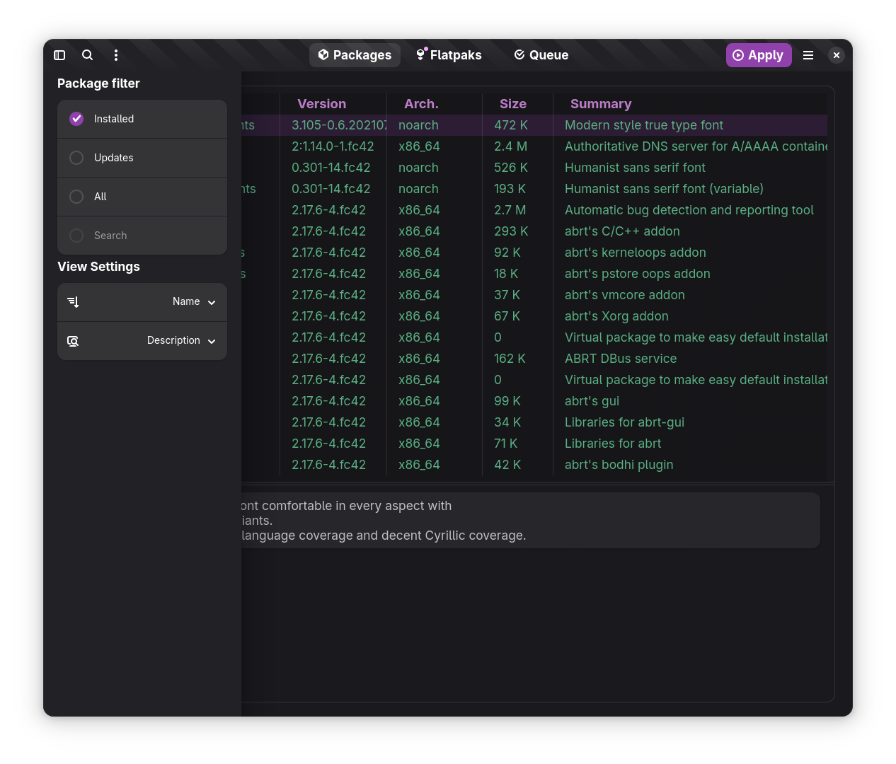
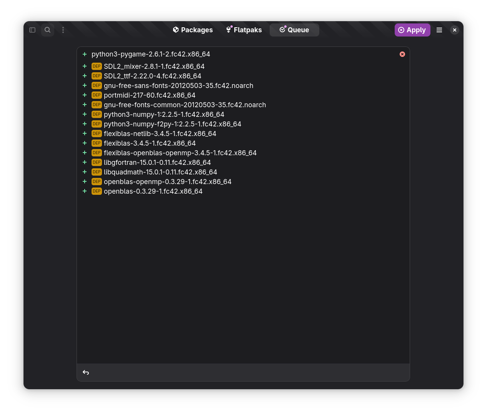
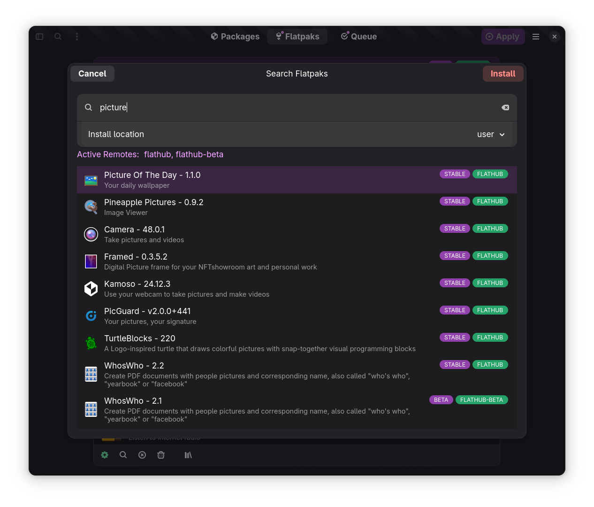

# Yum Extender (NextGen)

This is repository contains the next generation of yum extender
with a more modern look & feel using gtk4/libadwaita etc.

Follow news in [Announcements](https://github.com/timlau/yumex-ng/discussions/categories/announcements)

## how to test

-   check out this repository
-   install deps `make inst-deps`
-   run `./local.sh`

## build and install local test rpms

-   check out this repository
-   install deps `make inst-deps`
-   install build deps `make inst-build-tools`
-   `make test-inst` ( if yumex is not installed )
-   `make test-update` ( if yumex is installed on a previous date )
-   `make test-reinst` ( if yumex is installed on the same date )

## Packages for Fedora 41,42 & Rawhide (COPR)

**Stable**
[yumex-ng](https://copr.fedorainfracloud.org/coprs/timlau/yumex-ng/)

**Development**
[yumex-ng-dev](https://copr.fedorainfracloud.org/coprs/timlau/yumex-ng-dev/)

## Troubleshooting

[Check Here](docs/debug.md)

## current look

### Packages Page

### package view settings

### package search

### Queue Page

### flatpaks page

### flatpak installer

