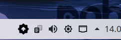

## Switch the updater to use an dark icon

Then using a display environment with light system tray, that don't support automatic changing colors on symbolic icons, like gnome
you can set the yumex-updater to switch to a dark icon.

```
gsettings set dk.yumex.Yumex upd-dark-icon true
systemctl --user restart yumex-updater
```



