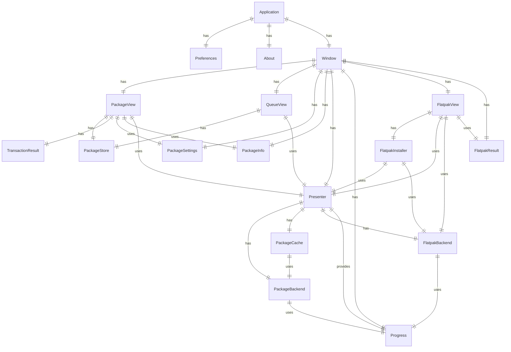

Overview of ownership and usage between components

```mermaid
erDiagram
    Application ||--|| Preferences : has
    Application ||--|| About : has
    Application ||--|| Window : has
    Window ||--|| PackageView : has
    Window ||--|| QueueView : has
    Window ||--|| PackageSettings : has
    Window ||--|| PackageInfo : has
    Window ||--|| Presenter : has
    Window ||--|| Progress : has
    Window ||--|| FlatpakView : has
    Window ||--|| FlatpakResult : has
    PackageView ||--|| PackageStore : has
    PackageView ||--|| TransactionResult : has
    PackageView ||--|| PackageSettings : uses
    PackageView ||--|| PackageInfo : uses
    PackageView ||--|| Presenter : uses
    QueueView ||--|| PackageStore : has
    QueueView ||--|| Presenter : uses
    FlatpakView ||--|| FlatpakInstaller : has
    FlatpakView ||--|| Presenter : uses
    FlatpakView ||--|| FlatpakBackend : uses
    FlatpakView ||--|| FlatpakResult : uses
    FlatpakInstaller ||--|| Presenter : uses
    FlatpakInstaller ||--|| FlatpakBackend : uses
    Presenter ||--|| PackageBackend : has
    Presenter ||--|| PackageCache : has
    Presenter ||--|| FlatpakBackend : has
    Presenter ||--|| Progress : provides
    PackageCache ||--|| PackageBackend : uses
    PackageBackend ||--|| Progress : uses
    FlatpakBackend ||--|| Progress : uses
```
